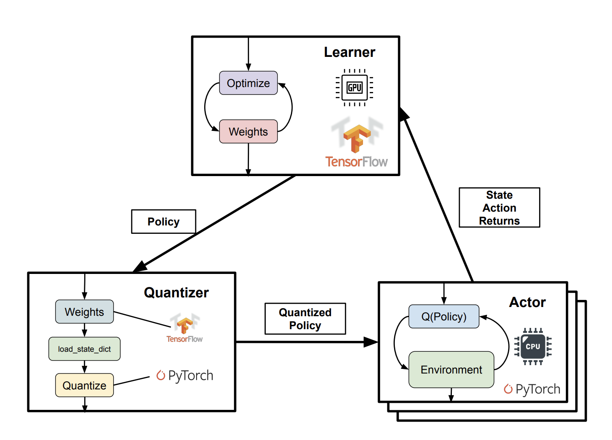
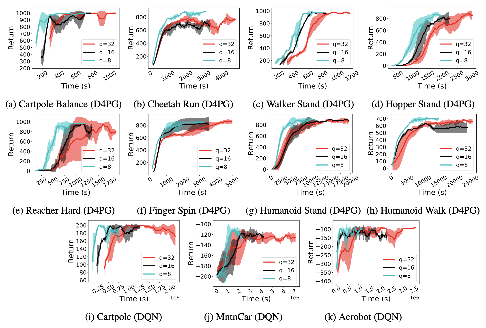
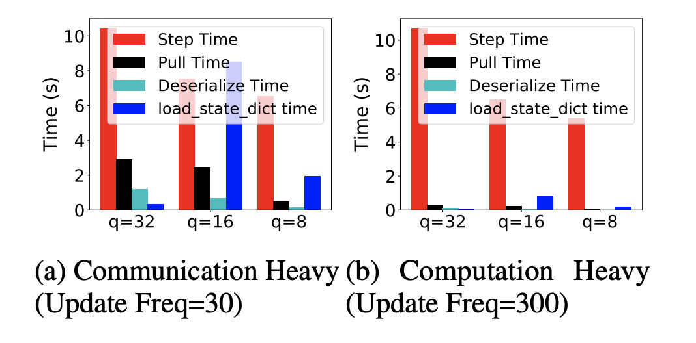

<p align="center">

</p>

# Quarl: Quantization For Reinforcement Learning

Code for QuaRL, a framework for evaluating the effects of quantization on reinforcement learning policies across different environments, training algorithms and quantization methods. 

# Table of Contents
1. [Introduction](#Introduction)
2. [Quickstart](#Quickstart)
3. [Results](#Results)
4. [Citations](#Citations)

## Introduction

Deep reinforcement learning has achieved significant milestones, however, the computational demands of reinforcement learning training and inference remain substantial. Using quantization techniques such as **Post Training Quantization** and **Quantization Aware Training**, a well-known technique in reducing computation costs, we perform a systematic study of Reinforcement Learning Algorithms such as A2C, DDPG, DQN, PPO and D4PG on common environments.

Motivated by the effectiveness of PTQ, we propose **ActorQ**, a quantized actor-learner distributed training system that runs learners in full precision and actors in quantized precision (fp16, int8). We demonstrated **end-to-end speedups of 1.5x - 2.5x** in reinforcement learning training with **no loss in reward**. Further, we breakdown the various runtime costs in distributed reinforcement learning training and show the effects of quantization on each.

<!--  -->



The framework currently support the following environments, RL algorithms and quantization methods.

#### Environments
- Atari Learning Environment (through OpenAI Gym)
- OpenAI Gym
- PyBullet
- Mujoco
- Deepmind Control Suite
#### RL Algorithms
- Proximal Policy Optimization (PPO)
- Actor Critic (A2C)
- Deep Deterministic Policy Gradients (DDPG)
- DQN (Deep Q Networks)
- D4PG (Distributed Distributional Deep Deterministic Gradients)
#### Quantization Methods
- Post-training Quantization (Located in `baseline`)
- Quantization Aware Training (Located in `baseline`)
- **ActorQ (for distributed RL)** (Located in `actorQ`)

Read the paper here for more information: https://arxiv.org/abs/1910.01055

## Quickstart
We suggest that you create an environment using conda first
```
conda create --name quarl python=3.6
conda activate quarl
```
For ubuntu:
```
./setup_ubuntu.sh
cd quant-scripts
```
For MacOS:
```
./setup_mac.sh
cd quant-scripts
```

### Baseline
#### 8-bit Post-training Quantization:
The PTQ algorithms require pre-trained models through `rl-baselines-zoo`.
```
python new_ptq.py ppo2 MountainCarContinuous-v0 8
python rl-baselines-zoo/enjoy.py --algo ppo2 --env MountainCarContinuous-v0 --no-render --folder quantized/8/ -n 50000
```

Note: PTQ can be run on any numerical precision between 2-32

#### fp16 Post-training Quantization:

```
python new_ptq.py ppo2 MountainCarContinuous-v0 fp16
python rl-baselines-zoo/enjoy.py --algo ppo2 --env MountainCarContinuous-v0 --no-render --folder quantized/8/ -n 50000
```

#### Benchmark a particular PTQ over an Algorithm, Environment
```bash
# Format ./benchmark.sh {algo} {env} {precision}
./benchmark.sh ppo2 MountainCarContinuous-v0

# Benchmark A2C MsPacman
./benchmark.sh a2c MsPacmanNoFrameskip-v4

# Create Sweetspot PNG
python collate.py a2c MsPacmanNoFrameskip-v4
```

#### Benchmark all algorithms over all environments and collect PNGs for all
```bash
./all.sh
./create_all_pngs.sh
```

#### Collate Sweetspot PNGs for all


#### 8-bit Quantization Aware Training and testing:

QAT usually requires training a model from scratch. We suggest setting quant-delay as half the total number of training steps. The official TF guidelines suggest finetuning min, max quantization ranges after the model has fully converged but in the case of RL over-training usually results in bad performance. QAT results also vary a lot depending on training so exact rewards as mentioned in the paper are not always guaranteed.

```
python qat.py --algo a2c --env BreakoutNoFrameskip-v4 -q 7 --quant-delay 5000000 -n 10000000
```

### ActorQ

Since our ActorQ implementation requires TF 2.0, we suggest creating a new environment.

```python
conda create --name actorq python=3.6
conda activate actorq
```

#### Setup

ActorQ is dependent on [Reverb](https://github.com/deepmind/reverb) for creating a parameter server, so ActorQ is only supported on Ubuntu at the moment. A [setup script](actorQ/setup_ubuntu.sh) is located in the `actorQ` directory which assumes a working installation of Mujoco. The rough steps are also desribed below:
1. Install Mujoco
2. Install Deepmind [ACME](https://github.com/deepmind/acme), [Reverb](https://github.com/deepmind/reverb)
3. Install zlib

#### Running ActorQ

ActorQ currently supports two algorithms, **Distributed Distributional Deep Deterministic Gradients (D4PG)** and **Deep Q Networks (DQN)**. Codes for them can be found in the directories `actorQ/d4pg` and `actorQ/dqn`.

There are three main processes that need to be run for ActorQ:
1. Learner
2. Parameter Server
3. Actors

A basic example of ActorQ:

```bash

n_actors=4
# Launch the Learner:

python learner_main.py --actor_update_period 300 \
  --taskstr gym,MountainCarContinuous-v0 --model_str 2048,2048,2048\
  --num_episodes 100000 --quantize_communication 32 --quantize 8\
  --replay_table_max_times_sampled 16 --batch_size 256 \
  --n_actors 4 --logpath logs/logfiles/ \
  --weight_compress 0 > logs/logs_stdout/learner_out

master_pid = $!
# Launch the Parameter Server:
python parameter_broadcaster.py --actor_update_period 300\
  --taskstr gym,MountainCarContinuous-v0 --model_str 2048,2048,2048\
  --num_episodes 100000 --quantize_communication 32 \
  --quantize 8 --replay_table_max_times_sampled 16 \
  --batch_size 256 --n_actors 4 --logpath logs/logfiles/ \
  --weight_compress 0 > logs/logs_stdout/broadcaster_out

# Launch the actors:
for i in `seq 1 $n_actors`; do 
    python actor_main.py --actor_update_period 300 \
     --taskstr gym,MountainCarContinuous-v0  --model_str 2048,2048,2048 \
     --num_episodes 100000  --n_actors 4  --quantize_communication 32 \
     --quantize 8 --replay_table_max_times_sampled 16 --batch_size 256 --actor_id $i \
     --logpath logs/logfiles/ --weight_compress 0  > logs/logs_stdout/actorid=${i}_out & 
    echo $!
done

# Wait
wait master_pid
```

An example with all hyperparameter settings of running ActorQ with 5 actors:
```bash

cd actorQ/d4pg/
./run_multiprocess.sh logs MountainCarContinuous-v0 2048,2048,2048 100000 4 256 16 32 32 30 0

# Arguments
# 1: Logdir: "{path}"
#      E.g. logs 
# 2: Task string: "f{suite},{env}"
#      E.g. gym,MountainCarContinuous-v0
#           dm_control,cartpole_balance
# 3: Model Architecture: "{layer 1},{layer2}, ...}"
#      E.g. 2048,2048,2048
# 4: Number of Episodes: int
#      E.g. 100000
# 5: Number of Actors: int
#      E.g. 4
# 6: Batch size: int
#      E.g. 256
# 7: Samples per Insert: int
#      E.g. 16
# 8: Quantized Actor Precision: int
#      E.g. 8
# 9: Quantized Communication Precision: int
#      E.g. 32
# 10: Actor Update Period: int
#      E.g. 20
# 11: Weight Compress: Bool in int
#      E.g. 0 or 1
```

### Visualization
Visualizing the model's parameter (weight & bias) distribution. These scripts can be found in `baseline` directory.

If the saved model is in '.pb' format, please run 
```
python visualize_pb.py -f <folder> -b <num_bits>
or: python visualize_pb.py --folder=<folder> --num_bits=<num_bits>
```

If the saved model is in '.pkl' format, please run 
```
python visualize_pkl.py -f <folder> -b <num_bits>
or: python visualize_pkl.py --folder=<folder> --num_bits=<num_bits>
```

The parameter distribution plot will be saved under ```<folder>```, and the detailed statistical information will be saved in ```output.txt``` under ```<folder>```.

For example, here is an example of visualizing the weights distribution for breakout envionment trained using DQN, PPO, and A2C:
<p align="center">

</p>

## Results
#### ActorQ end-to-end speedups



#### Distributed RL Training Breakdown


For more results, please check our [paper](https://arxiv.org/abs/1910.01055). 

## Citations
To cite this repository in publications:
```
@misc{quantized-rl,
    title={Quantized Reinforcement Learning (QUARL)},
    author={Srivatsan Krishnan and Sharad Chitlangia and Maximilian Lam and Zishen Wan and Aleksandra Faust and Vijay Janapa Reddi},
    year={2019},
    eprint={1910.01055},
    archivePrefix={arXiv},
    primaryClass={cs.LG}
}
```
