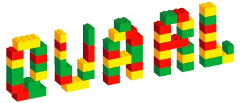

<p align="center">

</p>

# Quarl: Quantization For Reinforcement Learning

Code for QuaRL, a framework for evaluating the effects of quantization on reinforcement learning policies across different environments, training algorithms and quantization methods. 

# Table of Contents
1. [Introduction](#Introduction)
2. [Quickstart](#Quickstart)
3. [Results](#Results)
4. [Citations](#Citations)

## Introduction

Deep reinforcement learning has achieved significant milestones, however, the computational demands of reinforcement learning training and inference remain substantial. Using quantization techniques such as **Post Training Quantization** and **Quantization Aware Training**, a well-known technique in reducing computation costs, we perform a systematic study of Reinforcement Learning Algorithms such as A2C, DDPG, DQN, PPO and D4PG on common environments.

Motivated by the effectiveness of PTQ, we propose **ActorQ**, a quantized actor-learner distributed training system that runs learners in full precision and actors in quantized precision (fp16, int8). We demonstrated **end-to-end speedups of 1.5x - 2.5x** in reinforcement learning training with **no loss in reward**. Further, we breakdown the various runtime costs in distributed reinforcement learning training and show the effects of quantization on each.

<!--  -->


The framework currently support the following environments, RL algorithms and quantization methods.

#### Environments
- Atari Learning Environment (through OpenAI Gym)
- OpenAI Gym
- PyBullet
- Mujoco
- Deepmind Control Suite
#### RL Algorithms
- Proximal Policy Optimization (PPO)
- Actor Critic (A2C)
- Deep Deterministic Policy Gradients (DDPG)
- DQN (Deep Q Networks)
- D4PG (Distributed Distributional Deep Deterministic Gradients)
#### Quantization Methods
- Post-training Quantization (Located in `baseline`)
- Quantization Aware Training (Located in `baseline`)
- **ActorQ (for distributed RL)** (Located in `actorQ`)

Read the paper here for more information: https://arxiv.org/abs/1910.01055

## Quickstart
We suggest that you create an environment using conda first
```
conda create --name quarl python=3.6
conda activate quarl
```
For ubuntu:
```
./setup_ubuntu.sh
cd quant-scripts
```
For MacOS:
```
./setup_mac.sh
cd quant-scripts
```

### 8-bit Post-training Quantization:

```
python new_ptq.p
python ptq.py --algo dqn --env BreakoutNoFrameskip-v4 --int 1
```
### fp16 Post-training Quantization:

```
python ptq.py --algo dqn --env BreakoutNoFrameskip-v4 --fp16 1
```
### Run fp32 model using TFLite (as a control experiment):

```
python ptq.py --algo dqn --env BreakoutNoFrameskip-v4 --fp32 1
```
### 8-bit Quantization Aware Training and testing:

QAT usually requires training a model from scratch. We suggest setting quant-delay as half the total number of training steps. The official TF guidelines suggest finetuning min, max quantization ranges after the model has fully converged but in the case of RL over-training usually results in bad performance. QAT results also vary a lot depending on training so exact rewards as mentioned in the paper are not always guaranteed.

```
python qat.py --algo a2c --env BreakoutNoFrameskip-v4 -q 7 --quant-delay 5000000 -n 10000000
```

### Visualization
Visualizing the model's parameter (weight & bias) distribution.

If the saved model is in '.pb' format, please run 
```
python visualize_pb.py -f <folder> -b <num_bits>
or: python visualize_pb.py --folder=<folder> --num_bits=<num_bits>
```

If the saved model is in '.pkl' format, please run 
```
python visualize_pkl.py -f <folder> -b <num_bits>
or: python visualize_pkl.py --folder=<folder> --num_bits=<num_bits>
```

The parameter distribution plot will be saved under ```<folder>```, and the detailed statistical information will be saved in ```output.txt``` under ```<folder>```.

For example, here is an example of visualizing the weights distribution for breakout envionment trained using DQN, PPO, and A2C:
<p align="center">
  
</p>

## Results
For results, please check our [paper](https://arxiv.org/abs/1910.01055). 

## Citations
To cite this repository in publications:
```
@misc{quantized-rl,
    title={Quantized Reinforcement Learning (QUARL)},
    author={Srivatsan Krishnan and Sharad Chitlangia and Maximilian Lam and Zishen Wan and Aleksandra Faust and Vijay Janapa Reddi},
    year={2019},
    eprint={1910.01055},
    archivePrefix={arXiv},
    primaryClass={cs.LG}
}
```
